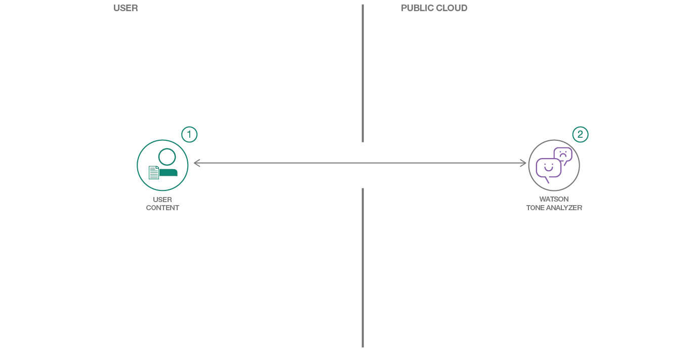

[](https://bluemix.net)
[](https://developer.apple.com/swift/)

# Create an iOS application in Swift which analyzes the emotion and tone of natural language

> We have a similar pattern available for [Android](https://github.com/IBM/tone-analyzer-android), as well!

In this code pattern, you will create an iOS application using the Watson Tone Analyzer service. You will be able to analyze emotions and tones in what people write online, such as in tweets or reviews, and then predict whether they are happy, sad, confident, and more. Monitor customer service and support conversations so you can respond to your customers appropriately and at scale. Enable your chatbot to detect customer tones so you can build dialog strategies to adjust the conversation accordingly.

When you have completed this code pattern, you will understand how to:

* Build a mobile application that uses Watson Tone Analyzer
* Provision and integrate additional IBM Cloud services
* Learn how to analyze emotions and tones in text



## Steps

> As an alternative to the steps below, you can [create this project as a starter kit](https://console.bluemix.net/developer/appledevelopment/create-app?defaultDeploymentToolchain=&defaultLanguage=IOS_SWIFT&env_id=ibm%3Ayp%3Aus-south&navMode=starterkits&starterKit=ec27f1fc-3410-3355-b774-fe1f783d8f9a) on IBM Cloud, which automatically provisions required services, and injects service credentials into a custom fork of this pattern. Then, you can skip directly to step 4 below.

1. [Install developer tools](#1-install-developer-tools)
1. [Install dependencies](#2-install-dependencies)
1. [Create a Tone Analyzer service instance](#3-create-a-tone-analyzer-service-instance)
1. [Run](#4-run)

### 1. Install developer tools

Ensure you have the [required developer tools installed from Apple](https://developer.apple.com/download/):

* iOS 8.0+
* Xcode 9.0+
* Swift 3.2+ or Swift 4.0+

### 2. Install dependencies

The IBM Cloud Mobile services SDK uses [CocoaPods](https://cocoapods.org/) to manage and configure dependencies. To use our latest SDKs you need version _1.1.0.rc.2_.

You can install CocoaPods using the following command:

```bash
$ sudo gem install cocoapods --pre
```

If the CocoaPods repository is not configured, run the following command:

```bash
$ pod setup
```

A pre-configured `Podfile` is included at `ios_swift/Podfile`. To download and install the required dependencies, run the following command in the `ios_swift` directory:

```bash
$ pod install
```
Now Open the Xcode workspace: `{APP_Name}.xcworkspace`. From now on, open the `.xcworkspace` file because it contains all the dependencies and configurations.

If you run into any issues during the pod install, it is recommended to run a pod update by using the following commands:

```bash
$ pod update
$ pod install
```

This project uses the Watson Developer Cloud iOS SDK in order to use the Watson Tone Analyzer service.

The Watson Developer Cloud iOS SDK uses [Carthage](https://github.com/Carthage/Carthage) to manage dependencies and build binary frameworks.

You can install Carthage with [Homebrew](http://brew.sh/):

```bash
$ brew update
$ brew install carthage
```

A pre-configured `Cartfile` is included in `ios_swift/Cartfile`. Run the
following command to build the dependencies and frameworks:

```bash
$ carthage update --platform iOS
```

> **Note**: You may have to run `carthage update --platform iOS --no-use-binaries`, if the binary is a lower version than your current version of Swift.

Once the build has completed, the frameworks can be found in the **ios_swift/Carthage/Build/iOS/** folder. The Xcode project in this repository already includes framework links to the following frameworks in this directory:

* **ToneAnalyzerV3.framework**
* **RestKit.framework**


If you build your Carthage frameworks in a separate folder, you will have to drag-and-drop the above frameworks into your project and link them in order to run it successfully.

### 3. Create a Tone Analyzer service instance

Use the [IBM Cloud Catalog](https://console.bluemix.net/catalog/) to [create a Tone Analyzer service instance](https://console.bluemix.net/catalog/services/tone-analyzer) on the Lite plan. Make sure to select **Use both legacy credentials and IAM** to receive the proper credential set for the Cloudant SDK.

When the service has been created, navigate to the **Service credentials** tab, and create a **New credential ⊕** with the default options. Click **View credentials**. Edit `toneanalyzerios/BMSCredentials.plist` in your Xcode project to configure your application with your Cloudant credentials.

### 4. Run

You can now run the application on a simulator or physical device:


The application allows you to use the Watson Tone Analyzer service to analyze text. Tone Analyzer leverages cognitive linguistic analysis to identify a variety of tones at both the sentence and document level. This insight can then used to refine and improve communications. It detects three types of tones, including emotion (anger, disgust, fear, joy and sadness), social propensities (openness, conscientiousness, extroversion, agreeableness, and emotional range), and language styles (analytical, confident and tentative) from text. Enter text in the input text box and then click the Tone Analyzer button to see the results. The results will be shown under each category after the text has been analyzed. The tag visibility will change based on the percentage returned from Watson, but you can click on tag directly to see the exact percentage.

## License

This code pattern is licensed under the Apache License, Version 2. Separate third-party code objects invoked within this code pattern are licensed by their respective providers pursuant to their own separate licenses. Contributions are subject to the [Developer Certificate of Origin, Version 1.1](https://developercertificate.org/) and the [Apache License, Version 2](https://www.apache.org/licenses/LICENSE-2.0.txt).

[Apache License FAQ](https://www.apache.org/foundation/license-faq.html#WhatDoesItMEAN)
